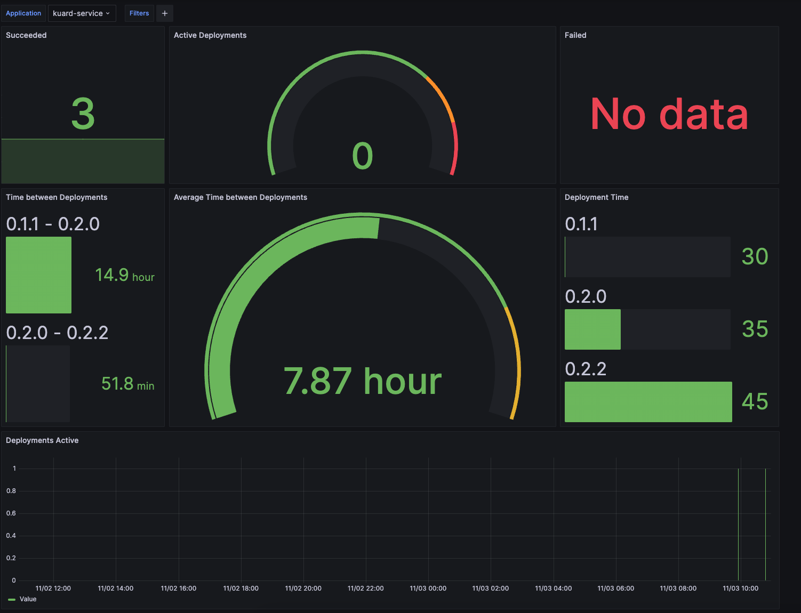

## Application Deployment Metrics

A basic observability solution for tracking application deployment frequency that utilizes the Tanzu supported packages for Grafana and Prometheus.  This solution leverages the keptn-lifecycle-toolkit to collect metrics on the frequency, longevity, and reliability of native kubernetes deployments.

### Prerequisites

- Carvel CLI tools installed (imgpkg, kbld)

- Cert Manager installed

- Tanzu Observability/Monitoring Installed (details below)

[Docs](https://docs.vmware.com/en/VMware-Tanzu-Kubernetes-Grid/2.2/using-tkg-22/workload-packages-monitoring.html)

Configure monitoiring and metrics packages as documented.  The following examples are minimally configured for ingress (check docs for the latest version and config of packages):

prometheus.yaml
```yaml

ingress:
  enabled: true
  virtual_host_fqdn: "prom.dora.h2o-2-18171.h2o.vmware.com"
  prometheus_prefix: "/"
  alertmanager_prefix: "/alertmanager/"

```

grafana.yaml
(there seems to be a bug with the default prom url in the current package so I am definig the datasource here manually too)
```yaml

grafana:
  secret:
    admin_user: YWRtaW4=
    admin_password: YWRtaW4=
  config:
    datasource_yaml: |-
      apiVersion: 1
      datasources:
      - orgId: 1
        name: Prometheus
        type: prometheus
        url: http://prometheus-server.tanzu-system-monitoring.svc.cluster.local
        access: proxy
        isDefault: true
ingress:
  enabled: true
  virtual_host_fqdn: grafana.dora.h2o-2-18171.h2o.vmware.com

```


```bash

tanzu package install prometheus \
--package prometheus.tanzu.vmware.com \
--version 2.43.0+vmware.2-tkg.1 \
--values-file prometheus.yaml \
--namespace tkg-system

tanzu package install grafana \
--package grafana.tanzu.vmware.com \
--version 9.5.1+vmware.2-tkg.1 \
--values-file graf2.yaml \
--namespace tkg-system

```

### Life Cycle Toolkit install

* Download the latest release tar

* Relocate the bundled release tar (this contains everything)

```bash

imgpkg copy --tar ~/Downloads/deployment-metrics-repo-72636ad71f8ad8e1aceb9c82677bff6745deb847.tar --to-repo <your registry>/deployment-metrics-repo --registry-ca-cert-path <add cert for self signed, if needed>

```

* If you are airgapped, you will need to identify the jaegertracing/all-in-one image in the bundle and specify it as a value so the operator can deploy the relocated image

```bash

imgpkg describe -b <your registry>/deployment-metrics-repo:<tag from relocated bundle> --registry-ca-cert-path ~/Downloads/harbor.build.new.cer

...

- Image: harbor.build.h2o-2-18171.h2o.vmware.com/library/metrics@sha256:d42e451d73188d1d47c60dff6cf645b73b7cc470a6463fcae03aa7dfb9ab8b59  #<-- use this relocated image reference
    Type: Image
    Origin: index.docker.io/jaegertracing/all-in-one@sha256:d42e451d73188d1d47c60dff6cf645b73b7cc470a6463fcae03aa7dfb9ab8b59
    Annotations:
      kbld.carvel.dev/id: jaegertracing/all-in-one:latest
      kbld.carvel.dev/origins: - resolved:
          tag: latest
          url: jaegertracing/all-in-one:latest

```

* Apply your package repo

```yaml
---

apiVersion: packaging.carvel.dev/v1alpha1
kind: PackageRepository
metadata:
  name: deployment-metrics-package-repo
  namespace: tkg-system
spec:
  fetch:
    imgpkgBundle:
      image: <your registry>/deployment-metrics-repo:<tag from imgpkg push above>

```


* Install the package

If you are airgapped include the overlay annotation in the PackageInstall and apply the overlay/data secret along with the packageinstall.  
If you have internet connectivity remove the annotation from the package install and skip applying the secrets.

```yaml

---
apiVersion: packaging.carvel.dev/v1alpha1
kind: PackageInstall
metadata:
  name: metrics
  namespace: tkg-system
  annotations:
    ext.packaging.carvel.dev/ytt-paths-from-secret-name.0: jaegar-image-overlay
spec:
  serviceAccountName: default-ns-sa
  packageRef:
    refName: deployment-metrics.tanzu.vmware
    versionSelection:
      constraints: 1.0.0
      prereleases: {}
  values:
  - secretRef:
      name: metrics-values
---
apiVersion: v1
kind: Secret
metadata:
  name: jaegar-image-overlay
  namespace: tkg-system
stringData:
  add-ns-label.yml: |
    #@ load("@ytt:data", "data")
    #@ load("@ytt:overlay", "overlay")
    #@overlay/match by=overlay.subset({"kind":"Jaeger"}),expects="1+"
    ---
    spec:
      #@overlay/match missing_ok=True
      allInOne:
        #@overlay/match missing_ok=True
        image: #@ data.values.jaegar_image
---
apiVersion: v1
kind: Secret
metadata:
  name: metrics-values
  namespace: tkg-system
stringData:
  values.yml: |
    ---
    jaegar_image: harbor.build.h2o-2-18171.h2o.vmware.com/library/metrics@sha256:d42e451d73188d1d47c60dff6cf645b73b7cc470a6463fcae03aa7dfb9ab8b59

```

### Do Something Useful with This

To begin collecting metrics on your deployments


Annotate monitored namespaces as follows:

```yaml

apiVersion: v1
kind: Namespace
metadata:
  name: name
  annotations:
    keptn.sh/lifecycle-toolkit: "enabled"


```

Annotate your deployments with the following:

```yaml

app.kubernetes.io/name: myAwesomeWorkload
app.kubernetes.io/version: myAwesomeWorkloadVersion
app.kubernetes.io/part-of: myAwesomeAppName

```

